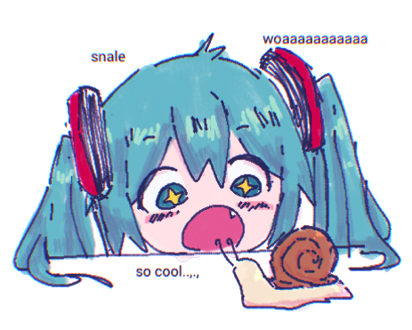

# Testing

This is a sentence.
This is also a sentence.
This is another sentence that drags on for a bit longer but not too long.
This is yet another sentence that drags on for a bit longer but now it is getting a bit too long.

_I can't wait for Vapor mode!_  
__I can't wait for Vapor mode!__  
___I can't wait for Vapor mode!___  
*I can't wait for Vapor mode!*  
**I can't wait for Vapor mode!**  
***I can't wait for Vapor mode!***  

- abc
- def
- ghi
  - jkl
    - mno
      - pqr
        - stu
    - vwx
      - yz

```swift
let highScoreThreshold = 1000 // A constant with type Int. The type was inferred based on the provided value.

var currentScore = 980 // A variable with type Int.
currentScore = 1200 // The value of variables can change over time.

let playerMessage: String // A constant with explicit type String.
if currentScore > highScoreThreshold {
    playerMessage = "You are a top player!"
} else {
    playerMessage = "Better luck next time."
}

print(playerMessage) // Prints "You are a top player!"
```

```js [file.js]
export default () => {
  console.log('Cool beans');
}
```

```js
console.log('Not focused');
console.log('Focused') // [!code focus]
console.log('Not focused');
```

```ts
console.log('No errors or warnings');
console.error('Error') // [!code error]
console.warn('Warning') // [!code warning]
```

```js {1,3-4} {"start":13}
console.log('1')
console.log('2')
console.log('3')
console.log('4')
```

```c
int main(int argc, char* argv[]) {
    protyping(); // [!code highlight]
    developing();
    testing(); // [!code --]
    deploying(); // [!code ++]
    return 1; // [!code warning]
}
```
```txt
Sparkle in the Twilight
Shimmer in the Sunset
```
```
The code glows bright on the display tonight
Not a culprit to be seen
A stack trace of desperation
And it looks like it’s on me

- Asahi Lina
```

```cpp
 
```

When $a \ne 0$, there are two solutions to $(ax^2 + bx + c = 0)$ and they are
$$ x = {-b \pm \sqrt{b^2-4ac} \over 2a} $$

> testing a b c  
> testing a b c  
> testing a b c  

> foo
> bar

> Lift($$L$$) can be determined by Lift Coefficient ($$C_L$$) like the following
> equation.
> 
> $$
> L = \frac{1}{2} \rho v^2 S C_L
> $$

`inline code`

| Syntax | Description |
| ----------- | ----------- |
| Header | Title |
| Paragraph | Text | 


|  |  |
| ----------- | ----------- |
| Paragraph | Text | 
| Paragraph | Text | 
| Paragraph | Text | 
| Paragraph | Text | 

Here's a sentence with a footnote. [^1]

[^1]: This is the footnote. 

# H1
## H2
### H3
#### H4
##### H5
###### H6

# H1 `monospace` text
## H2 `monospace` text
### H3 `monospace` text
#### H4 `monospace` text
##### H5 `monospace` text
###### H6 `monospace` text

[`nuxt` is awesome](https://nuxt.com)
# [`nuxt` is awesome](https://nuxt.com)
## [`nuxt` is awesome](https://nuxt.com)
### [`nuxt` is awesome](https://nuxt.com)
#### [`nuxt` is awesome](https://nuxt.com)
###### [`nuxt` is awesome](https://nuxt.com)

- [x] build website
- [x] build blog
- [ ] ship it

:heart: :sob: :scream:



:video{src="./media/2024-07-05 17-56-57.mp4" controls="true"}
<!-- :img{src="img.png"} -->
